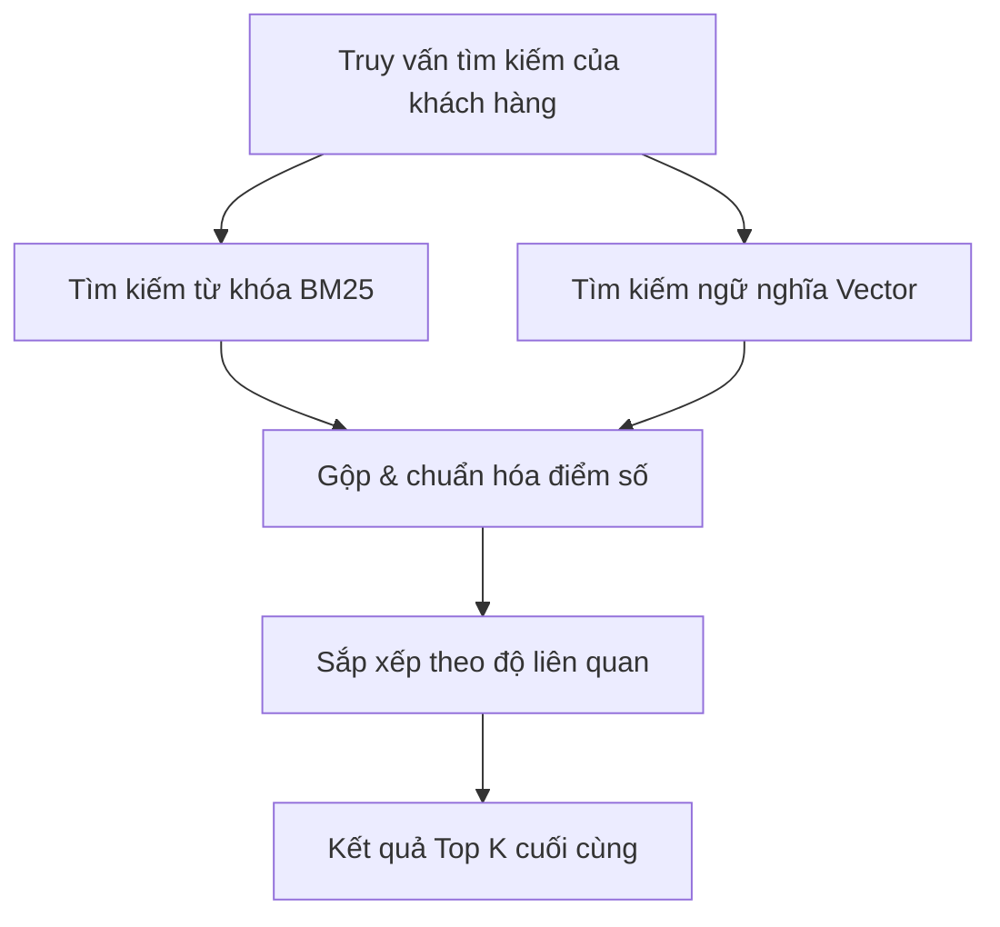

{}
⚠️ **Lưu ý:** Các thông tin dưới đây chỉ nhằm mục đích tham khảo, vui lòng **không sao chép nguyên văn** cho bài báo cáo của bạn kể cả warning này.
{}

# Cải thiện tìm kiếm lịch sử đơn hàng bằng Tìm kiếm ngữ nghĩa với Amazon OpenSearch Service

Nếu bạn từng mua sắm trên Amazon, chắc hẳn bạn đã quen thuộc với trang **Your Orders** (Đơn hàng của bạn). Tính năng này lưu trữ toàn bộ lịch sử mua sắm của khách hàng kể từ năm 1995, cho phép bạn theo dõi, tìm kiếm và quản lý mọi giao dịch trong quá khứ. Công cụ tìm kiếm lịch sử đơn hàng giúp bạn dễ dàng tìm lại các sản phẩm đã mua bằng cách nhập từ khóa. Không chỉ dừng lại ở việc tìm kiếm, nó còn cung cấp phương thức nhanh chóng để mua lại các sản phẩm cũ, giúp tiết kiệm thời gian và công sức đáng kể.

Rất nhiều tính năng cốt lõi trong trải nghiệm mua sắm của Amazon (như trợ lý mua sắm AI Rufus và trợ lý giọng nói Alexa) dựa vào công cụ tìm kiếm lịch sử đơn hàng để giúp người dùng định vị các giao dịch trước đó. Do đó, việc đảm bảo tính chính xác, trực quan và tốc độ xử lý nhanh chóng của hệ thống tìm kiếm này là vô cùng quan trọng.

Bài viết này sẽ chia sẻ chi tiết cách đội ngũ phát triển **Your Orders** của Amazon cải thiện trải nghiệm khách hàng bằng cách đưa các tính năng tìm kiếm ngữ nghĩa (semantic search) vào hệ thống tìm kiếm từ khóa (lexical search) sẵn có, thông qua việc sử dụng **Amazon OpenSearch Service** và **Amazon SageMaker**.

---

## Hạn chế của Tìm kiếm từ khóa (Lexical Search)

Trước đây, tìm kiếm lịch sử đơn hàng chủ yếu dựa vào **lexical matching** (khớp từ khóa). Cơ chế này trả về các mặt hàng chứa ít nhất một trong các từ khóa tìm kiếm. Ví dụ: khi khách hàng tìm kiếm *"nước cam"*, hệ thống sẽ lấy ra tất cả sản phẩm nước cam, cam tươi hoặc các loại nước trái cây khác mà khách hàng đã từng đặt mua.

Mặc dù tìm kiếm từ khóa rất hiệu quả đối với các truy vấn khớp chính xác từ ngữ, nó lại bộc lộ những hạn chế lớn:
* **Không hiểu đồng nghĩa & Ngữ nghĩa**: Hệ thống không thể xử lý các từ khóa mang tính khái niệm hoặc mô tả chung. Ví dụ, truy vấn *"đồ uống lành mạnh"* sẽ không thể hiển thị kết quả *"kombucha"*, *"trà xanh"* hoặc *"sữa protein"* nếu những từ khóa cụ thể này không xuất hiện trong tiêu đề hoặc mô tả sản phẩm.
* **Truy vấn dạng hội thoại**: Từ khi Rufus - trợ lý mua sắm tích hợp AI của Amazon ra đời, người dùng có xu hướng tìm kiếm tự nhiên hơn, chẳng hạn như *"Hiển thị các loại đồ uống lành mạnh tôi đã mua năm ngoái"*. Để đáp ứng điều này, cơ sở dữ liệu bên dưới phải hiểu được ngữ nghĩa sâu xa của từ khóa thay vì chỉ đối chiếu văn bản đơn thuần.

---

## Thách thức kỹ thuật khi triển khai ở quy mô lớn

Triển khai tìm kiếm ngữ nghĩa cho một hệ thống ở quy mô của Amazon đi kèm với các rào cả kỹ thuật rất lớn:

1. **Quy mô cực đại (Massive Scale)**: Hệ thống phải hỗ trợ tìm kiếm ngữ nghĩa trên hàng tỷ bản ghi lịch sử mua sắm của khách hàng trên toàn cầu.
2. **Không có thời gian chết (Zero Downtime)**: Hệ thống phải duy trì tính sẵn sàng 100% và đảm bảo các cam kết về chất lượng dịch vụ (SLA) nghiêm ngặt trong suốt quá trình nâng cấp và chuyển đổi cơ sở dữ liệu.
3. **Tránh làm giảm chất lượng tìm kiếm**: Tìm kiếm ngữ nghĩa nhằm mục đích cải thiện chất lượng kết quả, nhưng trong một số trường hợp, nó có thể phản tác dụng. Ví dụ:
   * Khi khách hàng nhớ chính xác tên sản phẩm và muốn tìm đúng sản phẩm đó, việc hiển thị thêm các sản phẩm tương tự hoặc có liên quan về mặt ngữ nghĩa sẽ làm loãng kết quả và gây khó chịu cho người dùng.
   * Tìm kiếm ngữ nghĩa hoàn toàn không có tác dụng đối với các tìm kiếm bằng mã định danh (như tìm kiếm theo *Mã đơn hàng - Order ID*), vốn không có ý nghĩa về mặt từ vựng hay ngữ nghĩa. Trong các tình huống này, hệ thống bắt buộc phải sử dụng tìm kiếm từ khóa thông thường.

---

## Tổng quan Kiến trúc Giải pháp

Tìm kiếm ngữ nghĩa được vận hành bởi các **Mô hình Ngôn ngữ Lớn (LLMs)**. Các mô hình này có khả năng tiếp nhận một đoạn văn bản (như cụm từ tìm kiếm của khách hàng hoặc mô tả sản phẩm) và chuyển đổi nó thành một chuỗi số có độ dài cố định, được gọi là **vector nhúng (embedding vector)**. Các vector này mã hóa ý nghĩa ngữ nghĩa của văn bản: hai văn bản có nội dung tương đồng sẽ có điểm số **độ tương đồng cosine (cosine similarity)** rất cao giữa các vector tương ứng.

Giải pháp của Amazon được chia làm hai phần kiến trúc lớn:
1. **Khả năng chịu tải hệ thống**: Chuyển sang kiến trúc phân cụm (cell-based architecture) nhằm tối ưu hóa việc xử lý các tác vụ vector tiêu tốn nhiều tài nguyên.
2. **Pipeline Ngữ nghĩa**: Xây dựng quy trình tạo, lưu trữ và truy xuất vector nhúng.

> *Hình 1. Sơ đồ kiến trúc phân cụm (cell-based) thể hiện cách định tuyến yêu cầu của khách hàng đến các domain Amazon OpenSearch Service thông qua phân vùng dựa trên mã băm*

---

## Khả năng mở rộng và Chịu tải: Kiến trúc Phân cụm (Cell-Based Architecture)

Để đảm đương tải lượng tính toán tăng thêm từ việc đối chiếu vector, đội ngũ phát triển đã áp dụng mô hình thiết kế **cell-based architecture**. Kiến trúc này chia nhỏ toàn bộ hệ thống thành các khối độc lập, giống hệt nhau gọi là các **cells** (phân cụm), mỗi cell chỉ chịu trách nhiệm xử lý một phần lưu lượng truy cập.

* **Phân vùng khách hàng**: Mỗi cell phục vụ một nhóm khách hàng cụ thể. Các cell hoạt động hoàn toàn độc lập và không cần giao tiếp với nhau khi xử lý yêu cầu.
* **Cơ chế định tuyến**: Yêu cầu từ khách hàng được định tuyến đến cell tương ứng của họ tại thời điểm chạy (runtime). Thông tin phân bổ cell có thể được tính toán động hoặc truy xuất từ bộ nhớ đệm/kho lưu trữ dữ liệu như **Amazon DynamoDB**. Điều này giúp việc phân phối lại dữ liệu giữa các cell cực kỳ linh hoạt khi có tình trạng quá tải cục bộ.
* **Độ bền bỉ cao**: Nếu một cell gặp sự cố, năng lực phục vụ của hệ thống chỉ bị giảm đi $1/N$ (với $N$ là số lượng cell) thay vì sập toàn bộ hệ thống. Các khóa phân vùng cũng có thể được ánh xạ vào hai hoặc nhiều cell để ghi dữ liệu dự phòng, loại bỏ nguy cơ mất mát dữ liệu.

---

## Triển khai Tìm kiếm Ngữ nghĩa

Quá trình tích hợp tìm kiếm ngữ nghĩa đòi hỏi các quyết định quan trọng về hạ tầng và mô hình:

> *Hình 2. Quy trình đọc (read-flow) và viết (write-flow) cho tìm kiếm ngữ nghĩa sử dụng Amazon OpenSearch Service và các vector nhúng từ Amazon SageMaker*

### 1. Đánh giá & Lựa chọn Mô hình
Đội ngũ phát triển đã sử dụng mô hình embedding được huấn luyện riêng trên dữ liệu thương mại điện tử của Amazon. Việc huấn luyện chuyên biệt theo lĩnh vực (domain-specific) giúp mô hình hiểu sâu sắc các thuật ngữ sản phẩm và ngữ cảnh kinh doanh.

Để tìm ra mô hình tốt nhất, họ đã sử dụng phương pháp **LLM-as-a-judge** (LLM làm giám khảo) với Anthropic's Claude trên nền tảng **Amazon Bedrock**. Trợ lý Claude nhận các câu lệnh chứa nội dung sản phẩm đã ẩn danh và các cụm từ tìm kiếm thực tế từ khách hàng, sau đó tiến hành phân loại và xếp hạng theo mức độ liên quan để làm dữ liệu đối chuẩn (ground truth). Các mô hình ứng cử viên được đánh giá qua các chỉ số xếp hạng tiêu chuẩn:
* **Normalized Discounted Cumulative Gain (NDCG)**: Đo lường chất lượng xếp hạng.
* **Mean Reciprocal Rank (MRR)**: Xem xét vị trí của kết quả liên quan đầu tiên.
* **Precision & Recall**: Đánh giá độ chính xác và độ phủ của kết quả.

### 2. Triển khai Hạ tầng
Mô hình embedding được chọn sau đó được đóng gói (containerized), đăng ký trong **Amazon Elastic Container Registry (Amazon ECR)** và triển khai thông qua các **Amazon SageMaker Inference Endpoints** để xử lý tính toán vector ở quy mô lớn với độ trễ thấp.

### 3. Lưu trữ Vector & Tìm kiếm với OpenSearch Service
Hệ thống tận dụng hai tính năng mạnh mẽ của **Amazon OpenSearch Service**:
* **Kiểu dữ liệu `knn_vector`**: Hỗ trợ lưu trữ trực tiếp các vector nhúng. Vì số lượng đơn hàng của mỗi khách hàng là tương đối nhỏ, đội ngũ đã chọn thuật toán **exact k-NN search** (tìm kiếm k lân cận chính xác) thay vì approximate k-NN (xấp xỉ). Điều này giúp hệ thống đạt độ chính xác tối đa mà vẫn đảm bảo hiệu năng.
* **Scripted Scoring (Tính điểm bằng kịch bản)**: Sử dụng các mã kịch bản Painless để tính toán độ tương đồng vector trực tiếp trên server của OpenSearch, giảm thiểu độ phức tạp cho phía client và duy trì độ trễ cực thấp.

---

## Tìm kiếm Hỗn hợp (Hybrid Search): Kết hợp Từ khóa & Ngữ nghĩa

Để tối ưu hóa kết quả tìm kiếm, Amazon đã triển khai mô hình **Hybrid Search**. Tính năng truy vấn hỗn hợp của OpenSearch Service chạy song song cả truy vấn từ khóa (BM25) và truy vấn ngữ nghĩa (vector).

* **Chạy song song**: Cả hai loại truy vấn được thực hiện đồng thời.
* **Chuẩn hóa điểm số**: OpenSearch tự động gộp và chuẩn hóa điểm số của hai luồng tìm kiếm.
* **Cơ chế dự phòng**: Đối với các truy vấn không có tính ngữ nghĩa (như tìm kiếm bằng `orderId`), hệ thống sẽ tự động bỏ qua tìm kiếm ngữ nghĩa và chỉ sử dụng khớp từ khóa.
* **Độ tin cậy**: Nếu luồng tìm kiếm ngữ nghĩa gặp sự cố tạm thời, hệ thống sẽ tự động chuyển hướng sử dụng kết quả từ tìm kiếm từ khóa để khách hàng luôn nhận được kết quả thay vì trang trắng lỗi.

---

## Backfilling: Xử lý Dữ liệu Lịch sử Đơn hàng

Để tính năng tìm kiếm ngữ nghĩa thực sự hữu ích, hàng tỷ dữ liệu đơn hàng cũ từ trước đến nay cần phải được bổ sung các vector nhúng tương ứng.

Đội ngũ đã thiết kế một pipeline xử lý dữ liệu quy mô lớn sử dụng:
* **AWS Step Functions** để điều phối toàn bộ quy trình cập nhật dữ liệu (backfill).
* **AWS Lambda** để xử lý các bản ghi cũ và gọi đến các SageMaker endpoints nhằm tạo vector nhúng.
* Quy trình này đã xử lý thành công hàng tỷ tài liệu với tốc độ cao hơn nhiều lần so với tốc độ nạp dữ liệu thông thường, chứng minh khả năng mở rộng mạnh mẽ của OpenSearch Service dưới áp lực tải lớn.

---

## Tác động Thực tế và Trải nghiệm Khách hàng

Việc áp dụng tìm kiếm ngữ nghĩa đã mang lại những cải tiến vượt trội về cả trải nghiệm người dùng lẫn các chỉ số kinh doanh:

* **Trải nghiệm mua sắm trực quan hơn**: Khách hàng giờ đây có thể tìm kiếm cụm từ *"dụng cụ ăn uống bền vững"* để tìm thấy thìa gỗ, hoặc tìm từ khóa *"sạc"* để ra các đầu nối sạc gắn tường, ngay cả khi tiêu đề sản phẩm không chứa từ "sạc".
* **Cải thiện 10% độ phủ truy vấn (Query Recall)**: Tăng đáng kể tỷ lệ các tìm kiếm trả về đúng sản phẩm mong muốn của khách hàng.
* **Tăng 20% tỷ lệ tìm kiếm thành công**: Nhiều lượt tìm kiếm của khách hàng hiện tại đã trả về ít nhất một sản phẩm liên quan.
* **Mở rộng 48% độ phủ kết quả (Result Coverage)**: Tìm kiếm ngữ nghĩa liên tục phát hiện và đề xuất các sản phẩm phù hợp mà tìm kiếm từ khóa thông thường chắc chắn sẽ bỏ sót.
* **Hỗ trợ đắc lực cho Rufus và Alexa**: Giúp các trợ lý ảo dễ dàng truy xuất thông tin từ lịch sử đơn hàng để trả lời các câu hỏi phức tạp từ người dùng.

---

## Kết luận

Bằng cách đưa khả năng tìm kiếm ngữ nghĩa vào lịch sử đơn hàng của Amazon, đội ngũ phát triển đã kết hợp thành công công nghệ AI tiên tiến với cơ sở hạ tầng truyền thống quy mô lớn. Với Amazon OpenSearch Service và Amazon SageMaker, giải pháp này không chỉ duy trì tính sẵn sàng tuyệt đối mà còn mở ra hướng đi mới cho các tính năng cá nhân hóa và tìm kiếm đa phương thức (multi-modal search) trong tương lai.

Để bắt đầu xây dựng ứng dụng tìm kiếm ngữ nghĩa của riêng bạn, bạn có thể tham khảo:
* [Tìm kiếm exact k-NN trong OpenSearch](https://docs.opensearch.org/latest/vector-search/vector-search-techniques/knn-score-script/)
* [Tài liệu hướng dẫn phát triển Amazon OpenSearch Service](https://docs.aws.amazon.com/opensearch-service/latest/developerguide/gsg.html)
